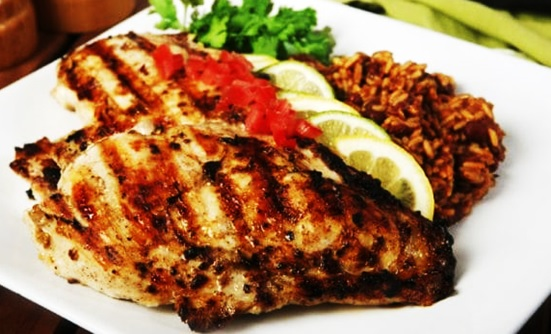

<html>
    <head>
        <meta charset="utf-8">
	<title>Chicken Court</title>
	<link rel = "icon" href = 
"Icon Logo.jpg" 
        type = "image/x-icon">
	<link rel="preconnect" href="https://fonts.gstatic.com">
	<link href="https://fonts.googleapis.com/css2?family=Girassol:wght@400&display=swap" rel="stylesheet">
	<link href="https://fonts.googleapis.com/css2?family=Karla:wght@500&display=swap" rel="stylesheet">
	<link href="https://fonts.googleapis.com/css2?family=Goblin+One&display=swap" rel="stylesheet">
        
    </head>
    <body>
	
 
	
		

		           <a href = "Portfolio.html" id = "Portfolio" class = "NavTools" target = "_blank"> Portfolio </a>
		            <a href = "homepage.html#theProducts" id = "Products" class = "NavTools" target = "_blank">Our products</a>
		           <a href = "AboutUs.html" id = "AboutUs" class = "NavTools" target = "_blank">About Us</a>
		

	

	
 
	              

		We provide the best types of chicken and meat dishes.
	                

	                
	

	
 
	                
	              

		We have strict environmental policies and the best corporate social responsibility policies.
	                

	

	
 
	                
	              

		Since our starting in the 2015, we have been provoding the best experiences to all our customers.
	                

	                
	

	
 
	             <h1>Our Products</h1>
	            

		

		     <h2  id = "hdo1" class = "itemH">Chicken Dishes</h2>
		<a href = "chickenPage.html" target = "_blank">
		     
		     
We provide all kinds of chicken dishes.

		</a>
		

		

		     <h2  id = "hdo2" class = "itemH">Mutton Dishes</h2>
		<a href = "muttonPage.html" target = "_blank">
		     
		     
All varieties of mutton dishes can be found on our site.

		</a>
		

		

		     <h2  id = "hdo3" class = "itemH">Rice dishes</h2>
		<a href = "ricePage.html" target = "_blank">
		     
		     
Delivering rice in delicious ways is our skill.

		</a>
		

		

		     <h2  id = "hdo4" class = "itemH">Other Dishes</h2>
		<a href = "beveragePage.html" target = "_blank">
		     
		     
Many other dishes are also sold by us.

		</a>
		

	             

	

	

	          <a href = "Portfolio.html" target = "_blank">Portfolio</a>
	          <a href = "AboutUs.html" target = "_blank">About Us</a>
	

    </body>
</html>
